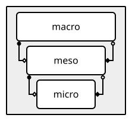
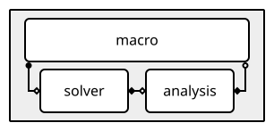
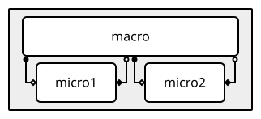

Describing models
-----------------

Coupled simulations consist of multiple computer programs that each simulate some part
of or process in the overall system being modelled. To simulate the whole system,
including interactions between the parts, we need to describe all the components and the
connections between them. This is done in the ``models`` section of the YAML file:

.. literalinclude:: example_model.ymmsl
   :caption: ``docs/example_model.ymmsl``
   :language: yaml

If you read this into a variable named ``config``, then ``config`` will contain
an object of type :class:`.ymmsl.v0_2.Configuration`. The yMMSL file above is a nested
dictionary (or mapping, in YAML terms) with at the top level the keys
``ymmsl_version``, and ``models``. The ``ymmsl_version`` key is
handled internally by the library, so it does not show up in the
:class:`.ymmsl.v0_2.Configuration` object. `models` is loaded into ``config.models``
likewise a dictionary mapping model names (as a :class:`.ymmsl.v0_2.Reference`) to
:class:`.ymmsl.v0_2.Model` objects:


.. code-block:: python
    :caption: Accessing the model

    from pathlib import Path
    import ymmsl

    config = ymmsl.load(Path('example_model.ymmsl'))
    model = config.models['macro_micro_model']

    print(model.name)                     # output: macro_micro_model
    print(len(model.supported_settings)   # output: 6


Note that ``model.name`` is filled automatically from the key, it doesn't have to be
specified twice.


Models
``````

The ``models`` section of the yMMSL document describes the simulation model. It has the
model's name, a list of simulation components, and it describes the conduits between
those components. Components include submodels (either programs or nested models, see
below) and helper components like scale bridges, data converters, caches, and any other
bits that make up the coupled simulation. Conduits are the wires between them that are
used to exchange messages.

Models are represented in Python by the :class:`.ymmsl.v0_2.Model` class. It has
attributes ``name``, ``ports``, ``description``, ``supported_settings``, ``components``
and ``conduits`` corresponding to those sections in the file. Only ``name`` and
``description`` are required, although a model without components and conduits isn't
very useful.

Attribute ``name`` is an :class:`.ymmsl.v0_2.Identifier` object containing the name of
the model.  An identifier contains the name of an object, like a simulation model, a
component or a port (see below). It is a string containing letters, digits, and/or
underscores which must start with a letter or underscore, and may not be empty.
Identifiers starting with an underscore are reserved for use by the software (e.g.
MUSCLE3), and may only be used as specified by the software you are using.

The :class:`.ymmsl.v0_2.Identifier` Python class represents an identifier. It works
almost the same as a normal Python ``str``, but checks that the string it contains is
actually a valid identifier.

Attribute ``description`` contains a longer description of the model, preferably
formatted using Markdown. Model ports are used when nesting models, and are explained
below.


Supported settings
``````````````````

Under ``supported_settings``, a description can be given of which settings the model
supports, so that any settings specified by the user can be checked and errors
identified before they can affect the simulation results. Each setting has a name, a
type (one of ``int``, ``str``, ``bool``, ``float``, ``[int]``, ``[float]``, or
``[[float]]`` where the latter three represent list-of-int, list-of-float, and
list-of-list-of-float respectively), and a description. Note that in the YAML, the
description is separated from the type by whitespace, and that it is not a comment.

Supported settings are stored in a :class:`.ymmsl.v0_2.SupportedSettings` object, which
acts like a dictionary mapping the setting name to a
:class:`.ymmsl.v0_2.SupportedSetting` object, which in turn has name, type and
description attributes. Types are represented by :class:`.ymmsl.v0_2.SettingType`.


Simulation Components
`````````````````````

Models may contain a subsection ``components``, in which the components making up the
simulation are described. More or less information may be given:

.. literalinclude:: macro_meso_micro.ymmsl
   :caption: ``docs/macro_meso_micro.ymmsl``
   :language: yaml

This fragment describes a macro-meso-micro model set-up with a single macro model
instance, a single meso model instance, and five micro model instances. For ``macro``,
only the required attributes are given: the name, ports (there aren't any), and a
description (which is empty).

Ports are the connectors on the component to which conduits attach to connect it to
other components, so a component with no ports, while allowed, is not very useful in a
coupled simulation. The meso model therefore has some ports and at least a short
description The ports are organised by operator; we refer to the MUSCLE3 documentation
for more on how they are used. The meso model also has an implementation, allowing it to
be run.

The micro model description shows how to write a longer description, which is always a
good thing to do to help remind other users (including your future self!) of what this
component does. The multiplicity specifies how many instances of this component exist in
the simulation. Multiplicity is a list of integers (e.g. ``[5, 10]`` for five sets of
ten instances), but may be written as a single integer if it's a one-dimensional set, as
shown here for ``micro``.

On the Python side, the ``components`` attribute of :class:`.ymmsl.v0_2.Model` always
contains a list of :class:`.ymmsl.v0_2.Component` objects:

.. literalinclude:: macro_meso_micro.py
   :caption: Accessing the components (``docs/macro_meso_micro.py``)

The ``implementation`` attribute of :class:`.ymmsl.v0_2.Component` refers to an
implementation definition. It should contain the name of a program or of another model,
which is used to implement this component, and which has all of the ports that the
component specifies.

Attributes ``name`` and ``implementation`` are of type :class:`.ymmsl.v0_2.Reference`. A
reference is a string consisting of one or more identifiers (as described above),
separated by periods. Depending on the context, this may represent a name in a namespace
or an attribute of an object (as we will see below with Conduits).


Timelines
`````````

Different components of a coupled simulation typically run at their own pace: a fast,
detailed micro model may take many small steps for every single step of the macro model
driving it, and a meso model may sit somewhere in between the two. yMMSL captures this
idea of "running at a different pace" as a *timeline*.

Timelines are determined separately for each model under ``models``, and are named
relative to that model. Each component has two timelines associated with it:

- Its *parent timeline* is the timeline of whatever calls it, i.e. the timeline on which
  the messages to its ``f_init`` ports are sent and the messages from its ``o_f`` ports
  are received. For a component that isn't called by any other component in the model,
  the parent timeline is empty.
- Its *component timeline* is the timeline it runs on itself. Its name is the name of
  the parent timeline followed by the name of the component, joined with a colon. A
  component that isn't called by anything therefore gets a timeline named after itself.

A component is called by another one through a call-and-release coupling, in which the
caller's ``o_i`` port sends to the callee's ``f_init`` port and the callee's ``o_f``
port sends back to the caller's ``s`` port. The caller's component timeline then becomes
the callee's parent timeline, so the callee's component timeline is nested inside the
caller's. Every level of nesting adds one more name, giving each timeline in the model
an addressable path, a bit like a folder structure. A dispatch coupling, in which one
component's ``o_f`` port sends to the next component's ``f_init`` port, does not add a
level: the second component gets the same parent timeline as the first, so the two end
up side by side.

Components and their ports are related to timelines in slightly different ways. A
component's ``o_i`` and ``s`` ports send and receive during its run, so they are on its
component timeline. Its ``f_init`` and ``o_f`` ports sit at the beginning and the end of
the component timeline, where the component hands over to and from its caller, so the
messages they receive and send belong to the parent timeline.

To make a valid conduit, you should connect two ports whose messages live on the same
timeline. :ref:`Conduit filters` and :ref:`Matching timelines` relax this rule
in specific cases.

Take a macro model that calls a meso model in a loop, and where that meso model in turn
calls a micro model in its own loop:

.. literalinclude:: timelines_macro_meso_micro.ymmsl
   :caption: ``docs/timelines_macro_meso_micro.ymmsl``
   :language: yaml


         micro the same way, producing three nested timelines.

   The same model, visualized with `ymmsl2svg
   <https://github.com/multiscale/ymmsl2svg>`_. The order of the boxes in the figure,
   from top to bottom, mirrors the nesting in time: ``macro`` first, then ``meso``
   below it, then ``micro`` below ``meso``.

``macro`` isn't called by anything, so its parent timeline is empty and its
component timeline is ``macro``. ``macro`` calls ``meso``, so ``meso``'s parent
timeline is ``macro`` and its component timeline is ``macro:meso``. Likewise,
``micro`` has parent timeline ``macro:meso`` and component timeline
``macro:meso:micro``. 

The conduit from ``macro.bc_out`` to ``meso.init_in`` isvalid because ``bc_out`` is an
``o_i`` port on ``macro``'s component timeline ``macro``, and the messages received by
the ``f_init`` port ``init_in`` are on ``meso``'s parent timeline, which is also
``macro``. The same reasoning applies to the other three conduits.

In a dispatch coupling, by contrast, no extra level is added. Here, ``macro`` calls
``solver``, which hands its result over to ``analysis``, which in turn returns to
``macro``:

.. literalinclude:: timelines_dispatch.ymmsl
   :caption: ``docs/timelines_dispatch.ymmsl``
   :language: yaml


         connects to analysis's F_INIT port, and analysis's O_F port connects back to
         macro's S port. solver and analysis are drawn side by side below macro.

   The same model, visualized with `ymmsl2svg
   <https://github.com/multiscale/ymmsl2svg>`_. ``solver`` and ``analysis`` are drawn
   side by side below ``macro``, since they share the same parent timeline.

``solver`` is called by ``macro``, so its parent timeline is ``macro``. ``analysis``
receives its ``f_init`` message from ``solver``'s ``o_f`` port, and those messages are on
``solver``'s parent timeline, so ``analysis`` gets that same parent timeline ``macro``.
The two components therefore end up side by side, on component timelines
``macro:solver`` and ``macro:analysis``.

None of these timelines are written in the yMMSL file itself: yMMSL works them out
automatically from how the components are wired together with conduits.

A single component can also be connected to more than one timeline at once, for example
when it drives two other components that run at different rates. ``macro`` calling
``micro1`` in one loop and ``micro2`` in a separate loop puts ``micro1`` and ``micro2`` on
two independent sub-timelines of ``macro``. The following example shows how you can
use ``timeline <name>:`` to indicate that the ports connecting to ``micro1`` belong to
a different subtimeline than the ports connecting to ``micro2``:

.. literalinclude:: timelines_two_subtimelines.ymmsl
   :caption: ``docs/timelines_two_subtimelines.ymmsl``
   :language: yaml


         one connecting down to micro2, side by side.

   The same model, visualized with `ymmsl2svg
   <https://github.com/multiscale/ymmsl2svg>`_. ``macro``'s two named timelines are drawn
   side by side beneath it, each with its own pair of ports, one leading to ``micro1``
   and the other to ``micro2``.

A named sub-timeline is written as the component name, a period, and the annotation.
Here, ``macro``'s first pair of O_I and S ports is on timeline ``macro.tl1`` and its
second pair on ``macro.tl2``, which puts ``micro1`` on ``macro.tl1:micro1`` and
``micro2`` on ``macro.tl2:micro2``. A timeline annotation must be a single name without
periods, so ``timeline tl1:`` is fine but ``timeline sub.tl1:`` is not.

Matching timelines
^^^^^^^^^^^^^^^^^^^

The timeline hierarchy above is worked out automatically from how the ``f_init``/``o_f``
and ``o_i``/``s`` ports are wired together, and a conduit is only valid if the messages
on both of its ends are on the same timeline. Sometimes, though, two components step
through the same time points without one being nested inside the other's timeline.
``matching_timelines`` lets you declare the timelines of such components equivalent, so
that a conduit can still connect their ports directly:

.. code-block:: yaml
    :caption: Declaring matching timelines

    components:
      left:
        ports:
          o_i: out
          s: in
        description: Left side of the domain
      right:
        ports:
          o_i: out
          s: in
        description: Right side of the domain

    matching_timelines:
      main: left right

    conduits:
      left.out: right.in
      right.out: left.in

``left`` and ``right`` each run on their own component timeline, ``left`` and
``right``, and their ``o_i`` and ``s`` ports are on those timelines. While running, they
exchange messages with each other directly through these ports, in an interact coupling. 
Because the two timelines are different, a conduit between these ports would not be
allowed. The components do however step through the same time points, so their timelines
are equivalent even though they are not the same. The entry under ``matching_timelines``
declares exactly that, so that the conduits connecting them are valid after all.

Each entry has a *head*, written on the left of the colon, and the timelines that match
it, written on the right. The head doesn't have to be one of the component timelines:
here it is a separate name, ``main``, so that neither ``left`` nor ``right`` is singled
out as the one the other follows. If one of the timelines does lead, as in the time
bridge example below, you can use that timeline as the head instead.

Matching timelines are also what makes a time bridge work. A time bridge lets two
components ``a`` and ``b`` that take different time steps exchange messages while they
run. The bridge sits in between and converts the messages from one side to the other,
so that each component receives messages with time stamps it can use. To do so, the
bridge runs on timelines of its own: a named sub-timeline for each side, on which it
follows the time points of the component on that side:

.. code-block:: yaml
    :caption: Two components on different timelines, connected through a time bridge

    components:
      a:
        ports:
          o_i: state_out
          s: state_in
        description: A model with its own time steps
      b:
        ports:
          o_i: state_out
          s: state_in
        description: A model with different time steps
      bridge:
        ports:
          timeline a_side:
            o_i: a_out
            s: a_in
          timeline b_side:
            o_i: b_out
            s: b_in
        description: Time bridge that converts messages between a and b

    matching_timelines:
      a: bridge.a_side
      b: bridge.b_side

    conduits:
      a.state_out: bridge.a_in
      bridge.a_out: a.state_in
      b.state_out: bridge.b_in
      bridge.b_out: b.state_in

Like any component, the bridge runs on its own timelines, ``bridge.a_side`` and
``bridge.b_side``, which differ from those of ``a`` and ``b``. Without
``matching_timelines``, none of the conduits in this example would therefore be valid.
But each side of the bridge does step through the same time points as the component on
that side, and the two entries under ``matching_timelines`` declare exactly that:
``bridge.a_side`` is equivalent to ``a``, and ``bridge.b_side`` to ``b``. 

Deeper timelines are matched by writing out their full path, e.g.
``macro1:micro1: macro2:micro2``. Matching timelines are taken into account after
applying any conduit filters, so a conduit with a ``repeat`` or ``last`` filter can also
connect to a timeline that matches the one it is filtered to.

On the Python side, ``matching_timelines`` is a list of
:class:`.ymmsl.v0_2.MatchingTimelines` objects, each representing a set of equivalent
timelines, with a ``head`` attribute and a ``matches`` attribute holding the full set,
including the head.

A head can have more than one match, as ``main`` does in the first example. The matches
can be written as a whitespace-separated string, as above, or, equivalently, as a YAML
list:

.. code-block:: yaml
    :caption: The same matching timelines, as a YAML list

    matching_timelines:
      main:
      - left
      - right


Conduits
````````

The final subsection of the ``model`` section is labeled ``conduits``. Conduits
tie the components together by connecting ports on those components. Only ports
specified by the component can be connected to, and hopefully its description explains
what kind of data the component expects to send or receive on each of its ports.

As you can see, the conduits are written as a dictionary on the YAML side, which maps
senders to receivers. A sender consists of the name of a component, followed by a period
and the name of a port on that component; likewise for a receiver. In the YAML file, the
sender is always on the left of the colon, the receiver on the right.

Just like the simulation components, the conduits get converted to a list in
Python, in this case containing :class:`.ymmsl.v0_2.Conduit` objects. The
:class:`.ymmsl.v0_2.Conduit` class has ``sender`` and ``receiver`` attributes, of
type :class:`.ymmsl.v0_2.Reference` (see above), and a number of helper functions to
interpret these fields, e.g. to extract the component and port name parts.

Note that the format allows specifying a slot here, but this is currently not
supported and illegal in MUSCLE3.

Multicast conduits
^^^^^^^^^^^^^^^^^^

In yMMSL you can specify that an output port is connected to multiple input
ports. When a message is sent on the output port, it is copied and delivered to
all connected input ports. This is called multicast and is expressed as
follows:

.. code-block:: yaml
    :caption: Specifying multicast in yMMSL

    conduits:
      sender.port:
      - receiver1.port
      - receiver2.port

This multicast conduit is converted to a a list of conduits sharing the same
sender:

.. code-block:: python
    :caption: Multicast conduits in python code

    from pathlib import Path
    import ymmsl

    config = ymmsl.load(Path('multicast.ymmsl'))

    conduits = config.model.conduits
    print(len(conduits))    # output: 2
    print(conduits[0])      # output: Conduit(sender.port -> receiver1.port)
    print(conduits[1])      # output: Conduit(sender.port -> receiver2.port)

Conduit filters
^^^^^^^^^^^^^^^

A conduit connects two components that call each other directly, for example ``macro``
and ``meso``, or ``meso`` and ``micro``. ``macro`` and ``micro`` are not directly
connected in this sense: ``meso`` sits between them. Connecting ``macro`` and ``micro``
directly, bypassing ``meso``, means their pace no longer matches: ``micro`` is still
called many times for every step ``macro`` takes, and still produces a message on
every one of those calls, even though there is no longer a ``meso`` in between to
absorb the difference. A conduit filter reconciles that mismatch.

Extending the macro-meso-micro example from :ref:`Timelines` with a fourth level,
``pico``, called by ``micro``, and adding conduits that bypass the levels in between
shows both kinds of filters in use, including combinations of them:

.. literalinclude:: conduit_filters_bypass.ymmsl
   :caption: ``docs/conduit_filters_bypass.ymmsl``
   :language: yaml

.. figure:: conduit_filters_bypass.svg
   :align: center
   :alt: macro, meso, micro and pico are nested inside each other. Extra pairs of
         conduits connect macro directly to micro, bypassing meso, and macro directly
         to pico, bypassing meso and micro.

   The same model, visualized with `ymmsl2svg
   <https://github.com/multiscale/ymmsl2svg>`_.

``macro`` produces the ``to_micro`` message once, but ``micro`` is called many times
for every step of ``macro`` and needs the message on each of those calls. The conduit
from ``macro.to_micro`` to ``micro.bypass_in`` uses a ``repeat`` filter for this: the
single message ``macro`` sends is resent to ``micro`` every time it runs, without
``meso`` having to relay it.

The reverse happens on the way back: ``micro`` produces a ``bypass_out`` message on
every one of its many runs, but ``macro`` still expects only one message per step. The
conduit from ``micro.bypass_out`` to ``macro.from_micro`` uses a ``last`` filter to
reduce those many messages down to the single most recently produced one.

- ``repeat`` and ``pad`` go from the shallower side to the deeper one: a single message
  is repeated, or followed by empty messages, to match every time the deeper side
  receives.
- ``last`` goes from the deeper side back to the shallower one: of the many messages
  produced, only the last one is passed on.

Filters are written in front of the receiver, and each filter bridges exactly one level
of nesting. To skip more than one level, you combine multiple filters on the same
conduit. The conduits between ``macro`` and ``pico`` skip both ``meso`` and ``micro``,
so each of them needs two filters. On the way down, ``repeat repeat`` repeats
``macro``'s single message for every call of ``micro`` inside ``meso``, and then again
for every call of ``pico`` inside ``micro``. On the way back up, ``last last`` first
reduces ``pico``'s many messages to the last one per call of ``micro``, and then those
to the last one per call of ``meso``, so that ``macro`` again receives a single message.

The number of filters has to equal the number of levels skipped: with only a single
``repeat`` on the conduit to ``pico``, the timelines on its two ends would not match and
the model would be rejected.


Nesting models
``````````````

The yMMSL language describes coupled simulations as graphs. For large systems with many
components and conduits, this gets rather unwieldy. In that case, it's best to subdivide
the model graph into submodels that are also graphs, which in turn contain programs, or
maybe even more graphs.

This is enabled in yMMSL by two features: model ports and models as implementations.

Like components, models can have ports:

.. code-block:: yaml
    :caption: A model with ports

    models:
      macro_micro:
        ports:
          f_init: initial_state_in
          o_f: final_state_out
        description:
          A macro micro model that can take an initial state from somewhere outside of
          the model, and send a final state to it
        components:
          macro:
            ports:
              f_init: initial_state_in
              o_i: bc_out
              s: bc_in
              o_f: final_state_out
            description: Macro model, implemented by a program
            # ...
          micro:
            # ...
        conduits:
          initial_state_in: macro.initial_state_in
          macro.final_state_out: final_state_out
          # ... other conduits connecting macro and micro

Model ports have the same operators as ports on components and ports on programs, and
they work in the same way. Conduits can connect model ports to ports on components and
vice versa. Note that these conduits connect an input port to an input port, and an
output port to an output port. They essentially function like extension cables for the
conduit outside the model that is connected to the model port.

Like programs, models can be used as implementations:

.. code-block:: yaml
    :caption: A nested model

    models:
      # ... continued from above
      uq:
        description:
          A model that runs an uncertainty quantification ensemble of the above model
        components:
          uq_driver:
            ports:
              o_i: initial_state_out
              s: final_state_in
            description: |
              This component creates a sample of initial states for the simulation, then
              sends them on initial_state-out to the model to be run. It then collects the
              final state for analysis on final_state_in.
            implementation: uq_driver

          uq_model:
            ports:
              f_init: initial_state_in
              o_f: final_state_out
            description: The model to be run
            implementation: macro_micro

In this example, the ``uq_model`` component is implemented using the ``macro_micro``
model shown previously. Each port specified for ``uq_model`` is present as a model port
in ``macro_micro``, allowing ``macro_micro`` to be used like this.

Multiple files and imports
``````````````````````````

A yMMSL file can contain multiple models that refer to each other, as shown above. For a
large system, especially if it is designed collaboratively by different people, it can
be useful to organise the models into different yMMSL files. The same goes for programs,
which are often written by different people and then reused in the coupled simulation.
It's convenient for each of these programs to come with its own yMMSL file describing
it (see :ref:`Describing programs`).

If the submodels and programs used in a model are not present in the same yMMSL file,
then they must be imported. Import statements go at the top of the yMMSL file, and look
like this:

.. code-block:: yaml
    :caption: Example import statements

    ymmsl_version: v0.2

    description: |
      An example yMMSL file with some import statements

    imports:
      - from utils.uq import implementation uq_driver
      - from models.macro_micro import implementation macro_micro

The first import statement would look for a file named ``uq.ymmsl`` in the ``utils/``
directory, and load a model program named ``uq_driver`` from it. The second one would
look in ``models/`` for a file named ``macro_micro.ymmsl`` and load a program or model
named ``macro_micro`` from it. Once imported, ``uq_driver`` and ``macro_micro`` can then
be used as implementation of a component.

To find files, ymmsl-python will look in two places:

1. Installed Python packages can provide "Entry Points" to provide importable yMMSL
   components.
2. The ``YMMSL_PATH`` environment variable can contain directories with importable yMMSL
   files.

These mechanisms are described in more detail below.


YMMSL Path
^^^^^^^^^^

Ymmsl-python will inspect the ``YMMSL_PATH`` environment variable for
directories to search. This should contain one or more colon-separated paths pointing to
directories with yMMSL files, in the same way that ``PATH`` points to directories with
executables and ``PYTHONPATH`` to directories with Python files to be imported.

For example, if ``YMMSL_PATH`` equals ``/home/user/ymmsl:/home/user/my_project`` then the
first import statement would first look for ``/home/user/ymmsl/utils/uq.ymmsl`` and then
for ``/home/user/my_project/utils/uq.ymmsl`` if that did not exist.


Python Entry Points
^^^^^^^^^^^^^^^^^^^

Installed Python packages can provide entry points for ymmsl-python to advertise that
they provide importable yMMSL components.
For example, the first import statement above would look for an entry point named
``utils.uq`` and try to load that configuration.

If you are a developer of a Python package and want to use the entry point mechanism so
users can import your component, you will need to:

1. Configure the entry point in your ``pyproject.toml`` (or ``setup.py``) file.
2. Provide the yMMSL configuration as a string inside your python distribution.

Below code listings provide an example how to do this.

.. code-block:: toml
    :caption: Entry point configuration in ``pyproject.toml``

    # Indicate you want to provide an entry point for "ymmsl.module":
    [project.entry-points."ymmsl.module"]
    # Provide one or more "name = value" entries, pointing to a valid yMMSL
    # configuration string (see next code listing). For more details, see
    # https://setuptools.pypa.io/en/latest/userguide/entry_point.html#entry-points-syntax
    "utils.uq" = "my_package.utils.uq:YMMSL_CONFIG"

.. code-block:: python
    :caption: yMMSL configuration string in ``my_package/utils/uq.py``

    import sys

    YMMSL_CONFIG = f"""
    ymmsl_version: v0.2
    description: Uncertainty Quantification utilities from my_package
    programs:
      uq_driver:
        description: |
          This component creates a sample of initial states for the simulation, then
          sends them on initial_state-out to the model to be run. It then collects the
          final state for analysis on final_state_in.
        executable: {sys.executable}
        args: -m my_package.utils.uq
        ports:
          o_i: initial_state_out
          s: final_state_in
    """


.. seealso::
  - User guide on Entry Points from setuptools:
    https://setuptools.pypa.io/en/latest/userguide/entry_point.html
  - The Entry Points specification:
    https://packaging.python.org/en/latest/specifications/entry-points/
